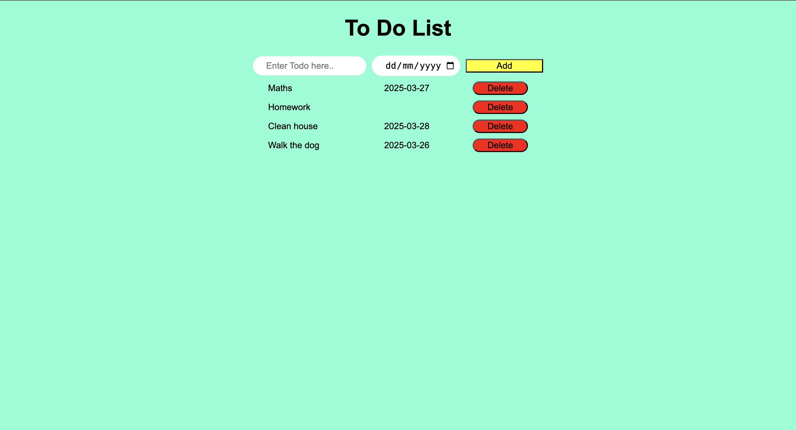

# 📝 To-Do List Application

A simple yet functional to-do list web app built with HTML, CSS, and vanilla JavaScript.

## ✨ Features

- **Task Management**:
  - Add new tasks with due dates
  - Delete completed tasks
  - Real-time task display
- **User-Friendly Interface**:
  - Clean, minimalist design
  - Responsive layout
- **Data Storage**:
  - In-memory task storage (persists during session)

## 🛠️ Technologies Used

- **Frontend**:
  - HTML5
  - CSS3
  - JavaScript (ES6)
- **No external dependencies**

